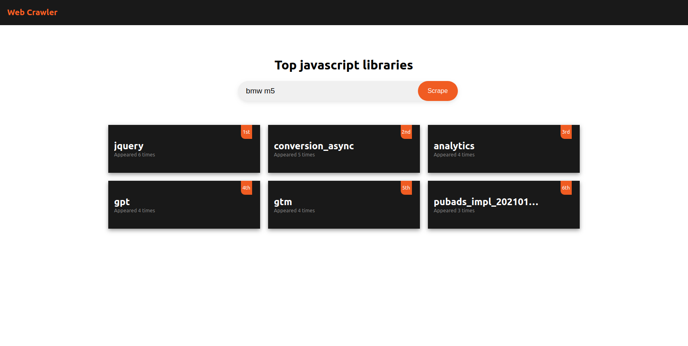

# Web Crawler

## About The Application

The purpose of this web application is to find the most commonly used javascript libraries.\
The libraries are scraped from six to ten first websites found on google search. 

The application has the following procedure:
* User can enter a search term and starts the crawling process
* The application does a Google search with that search term and scrapes the first six to ten links
* Next it scrapes the javascript libraries from each link individually,
* After all the javascript libraries are scraped, then it does a deduplication process by using Dice Coefficient Algorithms
  for string similarity with a 0.7 threshold
* Then it sorts the libraries based on their frequency and returns to the user top six of them



### Tech Stack
* Node.js
* npm
* Express
* React
* Puppeteer
* Jest


## Getting Started

To run the project locally you need have Node installed.\
After cloning the project into your pc, run the following commands:

```bash
cd web-crawler
npm install
```

### Starting the project: 

### ``npm run dev`` 

Starts both backend on port 8080 and fronend on port 3000.\
Or you can run them separately using the following comands:

```bash
npm run server (Starts only backend on port 8080)
npm run client (Starts only frontend on port 3000)
```
To run the application tests:
#### ```npm test ```


## Possible Improvements

The code coverage isn't great, I only did few simple unit tests with Jest and @testing-library. 
There could be done more on this, including Integration tests, E2E tests and puppeteer-jest too.

Next I think there needs to be done more work on error handling in scraping part to avoid any possible error that might occur.

## Contact

Dibran Xhymshiti 

Email: [dibranxhymshiti@gmail.com](mailto:dibranxhymshiti@gmail.com)

Linkedin: [https://www.linkedin.com/in/dibranxhymshiti/](https://www.linkedin.com/in/dibranxhymshiti/)
